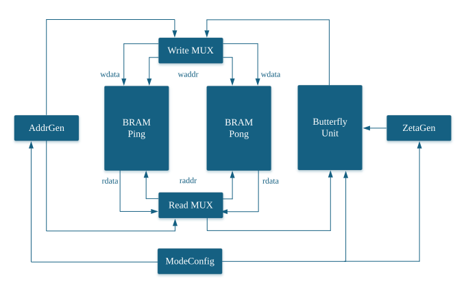
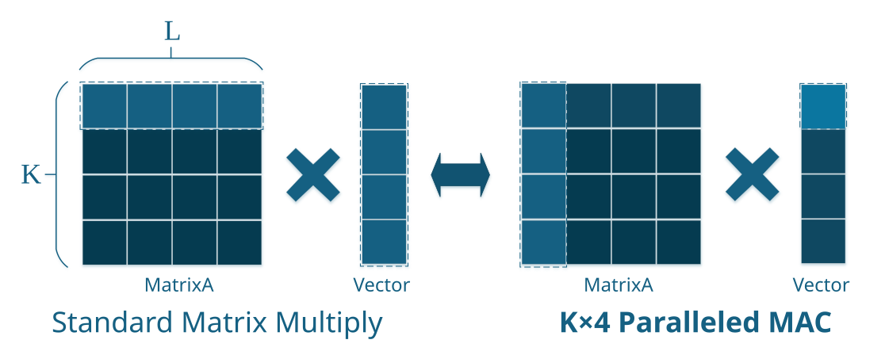
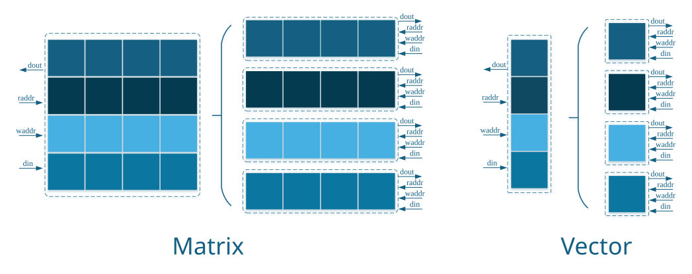

# 基于 Xilinx Artix-7 的 ML-DSA 后量子数字签名硬件加速器
本项目是一个基于 **SystemVerilog** 设计的高性能、可配置的 **ML-DSA** (Module-Lattice-Based Digital Signature Algorithm) 后量子密码硬件加速器，设计严格遵循 NIST 最新发布的 **FIPS 204** 标准，完整支持全链路的密钥生成（Keygen）、签名（Sign）与验证（Verify）操作，并兼容标准定义的三种安全级别：**ML-DSA-44、ML-DSA-65 及 ML-DSA-87**。

本项目采用了硬件开发的迭代策略，当前处于 **Phase 1** 阶段，并正向 **Phase 2** 推进：

- **[已完成] Phase 1: 架构验证与功能实现**
    - 完成了所有子模块（哈希、采样、NTT等多项式运算）的微架构设计与 SystemVerilog 编码。
    - 成功构建顶层数据通路，在 ModelSim/Vivado 仿真环境下跑通了 KeyGen、Sign 和 Verify 的全链路行为级仿真。
    - 核心算子逻辑（如 Radix-4 定常几何 NTT）功能验证无误。

- **[进行中] Phase 2: 时序收敛与性能优化**
    - **流水线重构**：依据 Vivado 的时序报告（Timing Summary），对关键路径（Critical Path）进行 Register 插入与流水线（Pipelining）切割，以提升系统的最高运行时钟频率（Fmax）。
    - **板级验证**：时序收敛后，计划在 Xilinx Artix-7 开发板上进行实际上板测试与功耗评估。

## 一、核心创新点
### 1. 高吞吐的 NTT/INTT 加速核心
在多项式运算模块中，摒弃了传统的顺序执行架构，设计并引入了基于 **基-4 定常几何(Radix-4 Constant Geometry)** 的多项式乘法加速单元，通过引入 **双BRAM乒乓缓存机制** ，将数据通路中的动态交叉互联重构为确定性静态路由，有效消除访存冲突，使256阶多项式数论变换的时钟周期开销降低 **75%**。
<details>
    <summary>详情</summary>

 <p align="center">
    
    <br>
    <b>定常几何硬件结构示意图</b>
</p>   

本模块的核心硬件数据通路主要由**双 BRAM 乒乓缓存（Ping-Pong BRAM）**、读写地址生成单元、基-4 蝶形运算单元（BU）以及旋转因子生成器构成。 

传统 NTT 架构在不同迭代级数中，蝶形运算的跨度（Stride）是动态变化的，这在硬件上会导致极其复杂的地址变换逻辑和庞大的数据选择器（MUX）网络。本设计引入了 **完美洗牌（Perfect Shuffle）** 机制，将动态拓扑重构为 **定常几何（Constant Geometry）** 结构。通过极简的地址移位与偏移计算，使得每一轮迭代从 BRAM 中读取数据的地址序列**完全相同**，极大降低了逻辑资源的消耗。

为匹配基-4 的超高吞吐率，系统将单侧的 Ping-Pong BRAM 物理切分为 4 组独立的子 BRAM（位宽 23-bit，深度 64）。结合定制的地址偏移映射逻辑，系统能够确保单周期内所需的 4 个操作数完美散列于 4 个不同的子 BRAM 中，从而实现 **4 系数同周期的无冲突读取与计算**。

#### 地址变换逻辑与 Pease 定理
定常几何架构的底层数学支撑来源于 **Pease 算法**，其针对 $N$ 阶多项式的基-$r$ 数论变换矩阵 $F_N$ 可分解为：

$$F_N = R \cdot \prod_{i=1}^{\log_r N} \left[ S_{N,r} \cdot (I_{N/r} \otimes B_r) \cdot T_i \right]$$

各算子的物理与硬件映射意义如下：
* **$F_N$**：代表 $N=256$ 阶的多项式 NTT 变换全局输出。
* **$R$ (位序反转矩阵)**：算法末端（或前端）的位序重排。在硬件中，通过在最终写回 RAM 时颠倒地址线的 bit 位来实现，实现**零逻辑延迟开销**。
* **$\prod_{i=1}^{\log_r N}$**：代表 NTT 的流水线级数（Stages）。对于 $N=256$, $r=4$，系统共需 $\log_4 256 = 4$ 级蝶形运算迭代。
* **$T_i$ (旋转因子对角阵)**：随迭代级数 $i$ 动态变化的旋转因子乘数。
* **$(I_{N/r} \otimes B_r)$ (恒定蝶形计算阵列)**：$B_r$ 代表基-4 蝶形小矩阵，$I$ 为单位阵，$\otimes$ 为克罗内克积。其物理意义是在空间上将基-4 蝶形单元平行复制 $N/4$ 份。该项与级数 $i$ 无关，**证明了底层计算硬件可以完全复用**。
* **$S_{N,r}$ (完美洗牌置换矩阵)**：仅包含 0 和 1 的置换矩阵，用于对输入向量进行全局“洗牌”。它将一维索引 $x$ 映射至新索引 $y$。正是这一项的引入，彻底消灭了动态跨度。

#### 完美洗牌与静态取值映射
为了将 $S_{N,r}$ 映射到实际的硬件寻址中，我们将长度为 256 的全局索引 $i$ 进行 4 进制展开：
$$i = (d_3, d_2, d_1, d_0)_4 \quad (d_k \in \{0, 1, 2, 3\})$$
其中 $(d_3, d_2, d_1)$ 代表子 RAM 中的行地址，$d_0$ 代表子 RAM 索引。

在传统的基-4 NTT 中，4 轮变换的跨度依次为 64、16、4、1（分别对应 4 进制数位 $d_3$、$d_2$、$d_1$、$d_0$ 的变化）。
本设计**用静态取值代替了动态地址变化**：在每一轮计算完毕的**写回（Write-back）阶段**，地址生成器对全局索引 $i$ 进行一次**循环左移 1 个四进制位**的操作，生成全新的写地址：
$$i' = (d_2, d_1, d_0, d_3)_4$$
通过这种极其廉价的连线移位操作，数据在物理存储中的排列被自动“洗牌”。因此，在进入下一轮迭代时，读取逻辑**永远只需要保持跨度为 64 的取值方式**（即始终对最高位进行操作），其实际等价于传统架构中跨度为 16 的寻址。这有效避免了庞大的地址 MUX 切换逻辑，大幅压缩了组合逻辑面积。

#### 基于空间映射的无冲突散列 (Bank Conflict Resolution)
为了在一个时钟周期内为 BU 单元提供 4 个操作数，必须保证这 4 个并发读取的地址绝对不会落在同一个子 BRAM 中。

根据多体存储映射定理，最佳的无冲突散列函数是对地址的特定位群求和模 $r$。我们设 6-bit 的行地址为 $t = (b_5b_4b_3b_2b_1b_0)_2$，将其划分为 3 个基-4 数位：
* $d_3 = (b_5b_4)_2$
* $d_2 = (b_3b_2)_2$
* $d_1 = (b_1b_0)_2$

我们定义**空间映射（Spatial Mapping）算子 $S(t)$**，用于决定数据存储在哪个子 RAM (0~3) 中：
$$S(t) = (d_3 + d_2 + d_1) \pmod 4$$

**无冲突定理证明：**
对于蝶形运算中任意步长为 $4^k$ 的 4 个并发读取地址 $t, t+4^k, t+2 \cdot 4^k, t+3 \cdot 4^k$：
由于每次递增的加数仅在某一个特定的基-4 数位 $d_k$ 上产生变化，而模 4 加法群 $\mathbb{Z}_4$ 在加 1、加 2、加 3 的操作下构成完备的循环群生成元。因此，这 4 个并发地址代入映射算子 $S(t)$ 后，**必定等概率地落入 $\{0, 1, 2, 3\}$ 这四个彼此独立的模等价类中**，从而从数学底层保证了 100% 的 Bank 并发访问无冲突。

</details>

### 2. 定制化支持单周期4系数并行处理的MAC计算单元
实现 **矩阵乘法** 模块与 **NTT/INTT输出数据流** 之间的零时钟延迟对接，显著提升整体吞吐率。
<details>
    <summary>详情</summary>

<p align="center">
    
    <br>
    <b>矩阵乘法</b>
</p>

<p align="center">
    
    <br>
    <b>BRAM结构</b>
</p>

#### 基于存储重构的零延迟多项式 MAC 阵列
多项式矩阵乘法是 ML-DSA 中调用最频繁、周期开销最大的算子。由于矩阵 $A$ 已预置于 NTT 域，而新生成的扩展向量处于标准整数域，后者必须经过 NTT 变换后才能与 $A$ 进行逐点乘法。为了实现更高效的矩阵乘法，需要构建一个**高度并行化**的计算单元。
**传统架构的挑战：** 
为节省 DSP 资源，系统复用了一组 NTT 硬件（每次处理 1 个 256 阶多项式）。但在传统矩阵乘法中，必须等待完整的 $l$ 个多项式全部完成 NTT 变换并存入 BRAM 后，才能整体读出执行行列内积，这引入了极长的流水线气泡与庞大的缓存开销。
**底层架构重构（Memory Banking）：** 
为完美匹配基-4 NTT 核心“单周期吐出 4 个系数”的极高吞吐率，本设计对底层存储空间进行了深度定制。我们将矩阵 $A$ 和累加缓冲区（如向量 $T$、$W$、$Z$）的 BRAM 实施了**按行分割映射**。
**性能收益（Zero-Latency）：** 
得益于存储重构，系统现在可以在单个时钟周期内并行完成 4 项复合操作：(1) **并行**读取矩阵 $A$ 同列的 4 个系数；(2) **直接**承接 NTT 实时输出的 4 个系数进行阵列乘法；(3) 并发读取缓冲区历史数据执行累加；(4) 将结果写回 BRAM。这实现了 NTT 变换流与 MAC 运算流的**零时钟延迟**对接，在不增加额外计算资源的条件下将吞吐率推向极限。
</details>

### 3. 统一资源调度架构
针对 ML-DSA 算法资源消耗大的痛点，设计全局  **BRAM 仲裁器 (GlobalBRAMArbitration)** 与 **计算资源仲裁器 (GlobalComputeArbitration)**。通过细粒度的状态机控制，在 KeyGen、Sign 和 Verify 三种模式间动态 **复用 NTT、INTT 与 MAC 阵列** 等庞大的算力单元，在不损失关键性能的前提下极致压缩了硬件面积。
具体内容可参考**第四部分**架构图。

## 二、项目文件结构

```
.
├── src/                            # 源代码目录
│   ├── param_conf.v                # 参数配置文件，定义 ML-DSA 安全级别参数
│   ├── Hash/                       # 哈希函数模块 (SHA3/SHAKE)
│   │   ├── Output                  # Testbench 输出内容
│   │   ├── RTL/
│   │   │   ├── sha3.sv             # SHA3 核心实现
│   │   │   ├── keccak.sv           # Keccak 置换层
│   │   │   ├── shake128.v          # SHAKE128 实现
│   │   │   └── shake256.v          # SHAKE256 实现
│   │   └── SIM/                    # 哈希模块测试平台
│   ├── Sampler/                    # 采样器模块
│   │   ├── Output                  # Testbench 输出内容
│   │   ├── RTL/
│   │   │   ├── ExpandA.sv          # 矩阵 A 扩展采样
│   │   │   ├── ExpandC.sv          # 挑战多项式采样
│   │   │   ├── ExpandS.sv          # 秘密向量采样
│   │   │   ├── ExpandY.sv          # 临时向量采样
│   │   │   └── ExpandY_sipo*.sv    # 不同位宽的 SIPO 移位寄存器
│   │   └── SIM/                    # 采样器测试平台
│   ├── CoeffBlockRAM/              # 系数块 RAM 模块
│   │   └── RTL/
│   │       ├── CoeffBlockRAM.sv    # 统一系数存储架构
│   │       ├── MatrixA.sv          # 矩阵 A 存储
│   │       ├── Vector*.sv          # 各类向量存储 (S1, S2, T, Y, M)
│   │       └── Encode*.sv          # 编码输出存储 (PK, SK, Sig)
│   ├── Polynomials/                # 多项式运算模块
│   │   ├── ROM_INIT                # 旋转因子初始化文件
│   │   ├── RTL/
│   │   │   ├── NTT_BU.sv           # 数论变换基础单元
│   │   │   ├── INTT_BU.sv          # 逆数论变换基础单元
│   │   │   ├── ModuleMult.sv       # 模乘器
│   │   │   ├── ModuleAdd.sv        # 模加器
│   │   │   ├── ModuleSub.sv        # 模减器
│   │   │   ├── ModuleDiv2.sv       # 模除 2
│   │   │   ├── MAC_Array_Pool.sv   # MAC 阵列池
│   │   │   ├── ReconfigCompute.sv  # 可重构计算单元
│   │   │   ├── Poly_PAU.sv         # 多项式处理单元
│   │   └── SIM/                    # 多项式运算测试平台
│   ├── En_Decoder/                 # 编解码模块
│   │   ├── Encoder.sv              # 主编码器
│   │   ├── Encoder_single_channel.sv
│   │   ├── power2round.sv          # 幂次舍入
│   │   └── sync_fifo_fwft.sv       # 同步 FIFO
│   ├── Auxilary/                   # 辅助功能模块
│   │   ├── Output                  # Testbench 输出内容
│   │   ├── RTL/
│   │   │   ├── decompose.sv        # 系数分解
│   │   │   ├── make_hint.sv        # 提示位生成
│   │   │   └── use_hint.sv         # 提示位使用
│   │   └── SIM/
│   ├── keygen/                     # 密钥生成模块
│   │   ├── Output                  # Testbench 输出内容
│   │   ├── RTL/
│   │   │   ├── keygen.v            # 密钥生成顶层
│   │   │   └── keygen_internal.sv  # 密钥生成内部实现
│   │   └── SIM/
│   ├── sign/                       # 签名生成模块
│   │   ├── Output                  # Testbench 输出内容
│   │   ├── RTL/
│   │   │   ├── sign_internal.sv    # 签名内部实现
│   │   │   ├── coeffModq.sv        # 模 q 约简
│   │   │   ├── Serializer.sv       # 串行化器
│   │   │   ├── Gearbox_2to4.sv     # 数据宽度转换
│   │   └── SIM/
│   ├── verify/                     # 验证模块
│   │   ├── RTL/
│   │   │    └── verify_internal.sv # 验证内部实现
│   │   └── SIM/
└── top/                            # 顶层集成模块
    ├── Output                      # Testbench 输出内容
    ├── ML_DSA_top.sv               # 芯片顶层模块
    ├── GlobalBRAMArbitration.sv    # BRAM 仲裁器
    ├── GlobalComputeArbitration.sv # 计算资源仲裁器
    ├── SharedBRAMPool.sv           # 共享 BRAM 池
    ├── SharedComputePool.sv        # 共享计算池
    └── simulation/
        └── tb_ML_DSA_top.sv        # 顶层测试平台
```

## 三、主要特性

### 1.灵活的安全级别支持
系统通过修改 `src/param_conf.v` 中的宏定义，即可在编译期无缝切换不同的安全级别，系统自动推导底层相关硬件参数：

| 安全级别 | 宏定义 | k | l | η | γ₁ | γ₂ | τ | ω |
|---------|--------|---|---|---|----|----|---|---|
| ML-DSA-44 | `ML_DSA_44` | 4 | 4 | 2 | 2<sup>17</sup> | 95232 | 39 | 80 |
| ML-DSA-65 | `ML_DSA_65` | 6 | 5 | 4 | 2<sup>19</sup> | 261888 | 49 | 55 |
| ML-DSA-87 | `ML_DSA_87` | 8 | 7 | 2 | 2<sup>19</sup> | 261888 | 60 | 75 |

### 2.核心子系统
- **密钥生成 (KeyGen)**：自动生成公钥 ($pk$) 和私钥 ($sk$)，支持标准随机种子 ($zeta$) 注入，内部集成矩阵 $A$ 展开与向量 $S/T$ 的并行处理。
- **签名生成 (Sign)**：输入预哈希消息 $\mu$ (512-bit) 与随机数 $rnd$ (256-bit)，高速生成目标签名 $(z, h, \tilde{c})$，内部硬件直接支持复杂的拒绝采样循环机制。
- **签名验证 (Verify)**：利用高效的多项式矩阵乘法数据路径，快速验证公钥 $pk$、签名 $(z, h, \tilde{c})$ 与预哈希消息 $\mu$ 的合法性。

## 四、架构设计
本设计采用了**动态资源共享架构**，系统核心被划分为 **“共享计算池”** 与 **“共享存储池”**。通过顶层仲裁器，确保同一物理资源在不同操作模式下达到最高利用率。

### 1.模式控制(`mode_config[1:0]`)
资源分配由系统状态机根据工作模式进行动态路由：
- `2'd0`: KeyGen 模式 - 分配资源用于密钥生成流水线
- `2'd1`: Sign 模式 - 分配资源用于签名生成与拒绝采样循环
- `2'd2`: Verify 模式 - 分配资源用于签名合法性校验

### 2.顶层接口规范
模块提供标准化的握手接口，便于与 AXI 等总线或上位机进行桥接
**全局控制**
- `clk`: 系统时钟
- `rstn`: 异步复位 (低电平有效)

**KeyGen 接口：**
- 输入：`start_keygen` (启动脉冲), `zeta_keygen [255:0]` (随机种子)
- 输出：`key_ready_keygen` (就绪), `done_keygen` (完成脉冲)

**Sign 接口：**
- 输入：`start_sign` (启动脉冲), `mu [511:0]` (512位预哈希消息), `rnd [255:0]` (256位随机数)
- 输出：`sign_ready` (就绪), `done_sign` (完成脉冲)

**Verify 接口**
- 输入：`start_verify` (启动脉冲), `mu_verify [511:0]` (512位预哈希消息)
- 输出：`verify_ready` (就绪), `done_verify` (完成脉冲), `verify_flag` (1=成功，0=失败)

## 五、关键算法参数说明
*(以下为 ML-DSA-44 默认配置参考)*
| 参数名 | 描述 | 默认值 (ML-DSA-44) |
|--------|------|-------------------|
| `n` | 多项式维度 | 256 |
| `q` | 模数 | 8380417 |
| `d` | T 向量高位比特数 | 13 |
| `tau` | 挑战多项式非零系数数 | 39 |
| `gamma_1` | y 向量系数范围 | 131072 |
| `gamma_2` | w 向量低位阈值 | 95232 |
| `beta` | 边界参数 | 78 |
| `omega` | 提示向量权重 | 80 |

## 六、注意事项与使用指南
1. 参数配置：默认编译宏指向 `ML_DSA_44`。若需进行其他安全级别的综合与仿真，请务必先在 `src/param_conf.v` 中修改激活相应的宏。

2. 哈希标准：项目中所有的内部散列与扩展操作均严格调用底层的 SHA-3 (SHAKE-128 / SHAKE-256) 硬件实体，未做任何非标截断。
